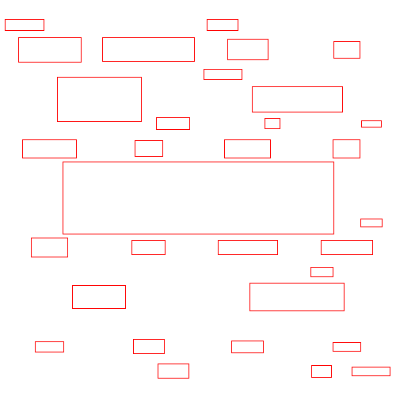

## This project is a work in progress

## Sample Results
### Sample Output

### Sample Word Bounds for Collision Detection

## Sample Word Placement Grid

## References
1. [1984 by George Orwell, Uploaded by Project Gutenberg Australia](https://gutenberg.net.au/ebooks01/0100021.txt)
2. [StackOverflow - Algorithm to Implement Word Cloud like Wordle](https://stackoverflow.com/questions/342687/algorithm-to-implement-a-word-cloud-like-wordle)
3. [Wordle by Jonathan Feinberg](http://static.mrfeinberg.com/bv_ch03.pdf)
4. [Known English Stop Words by PyTagCloud](https://github.com/atizo/PyTagCloud/blob/master/pytagcloud/lang/stop/english)
5. [Fonts for Word Clouds by PyTagCloud](https://github.com/atizo/PyTagCloud/tree/master/pytagcloud/fonts)
6. [AABBTree PyPi Project by Kenneth Hart](https://pypi.org/project/aabbtree/)