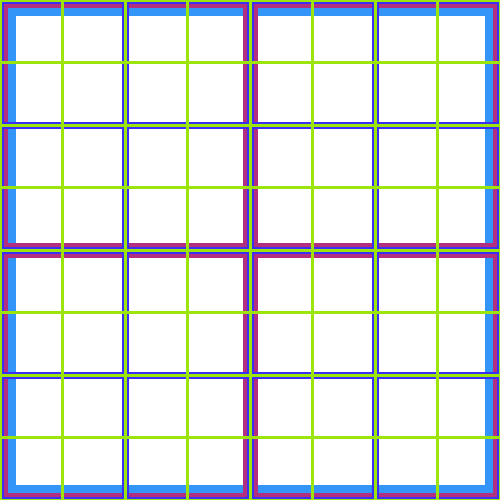

# Word Cloud Generator
## Algorithm Overview
This is a Word Cloud Generator, which will attempt to place `w` number of the most common words from an input text file, `f`, on an image of size `NxN`. Below I've summarized my implementation and some of the considerations taken:
1. Collect input parameters `w`, `f`, and `N`
2. Build Dictionary of `stopwords`, which uninteresting words to blacklist.
3. Build the `vocabulary` Dictionary, which are the words contained in `f` that are NOT in the `stopwords` Dictionary.
4. Generate an `NxN` grid to optimize placement of words in the generated Word Cloud, as the program only tries to place words in places where two lines of the same colour/ thickness intersect perpendicularly.
5. Attempts to place each word on each remaining square in the`NxN` grid
   1. A valid placement is:
      1. When the collision box around the word to be placed does NOT collide with any other placed word's collision box.
      2. When the collision box around the word lies within the `NxN` grid's coordinates
6. Upon successful execution, the output Word Cloud image will be saved to `output/wordcloud.png`

## Sample Execution

## Sample Results
### Sample Outputs 
  

- Left most image is the generated Word Cloud
- Middle image is the words bound detection boxes visualized
- Right most image is grid which optimizes word placement with minimal conflicts

## References
1. [1984 by George Orwell, Uploaded by Project Gutenberg Australia](https://gutenberg.net.au/ebooks01/0100021.txt)
2. [StackOverflow - Algorithm to Implement Word Cloud like Wordle](https://stackoverflow.com/questions/342687/algorithm-to-implement-a-word-cloud-like-wordle)
3. [Wordle by Jonathan Feinberg](http://static.mrfeinberg.com/bv_ch03.pdf)
4. [Known English Stop Words by PyTagCloud](https://github.com/atizo/PyTagCloud/blob/master/pytagcloud/lang/stop/english)
5. [Fonts for Word Clouds by PyTagCloud](https://github.com/atizo/PyTagCloud/tree/master/pytagcloud/fonts)
6. [AABBTree PyPi Project by Kenneth Hart](https://pypi.org/project/aabbtree/)